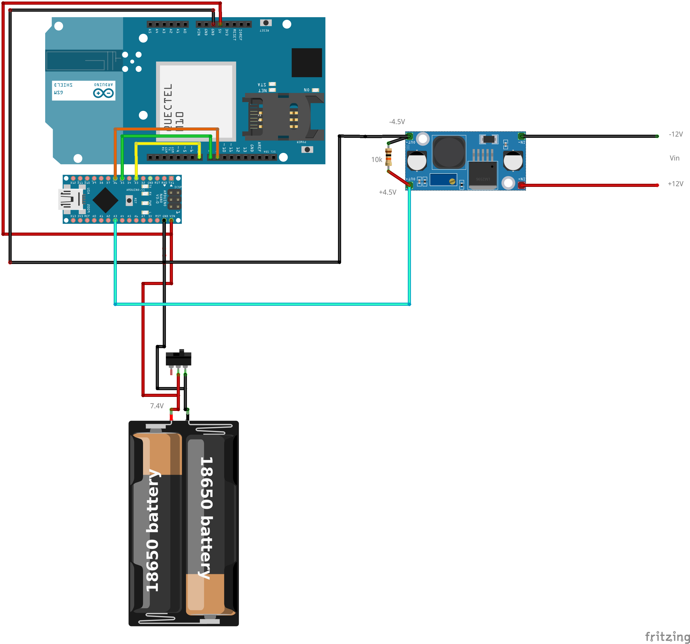

# GSM-SIM-900L
<h1> Arduino GSM </h1>

<h3> Descripción y objetivo del proyecto </h3>

Senscillo programa desarrollado en C++ que permite realizar llamadas telefónicas por la línea movil gsm cuando el Arduino Nano detecta que una entrada que está continuamente leyendo pasa a estado alto.  

El objetivo es aprovechar un sistema de alarma ya montado que hace uso de linea de telefono fijo para avisar de las incidencias. Con este programa podemos eliminar el coste mensual de la linea de telefono fijo y realizar las llamadas de aviso a través de una línea móvil con un coste de 0€ / mes.   

<h3> Componentes necesarios </h3>
Arduino Nano V3.0.
SiM 900 L.
Buck converter.
Batrías de litio 18650.
BMS.
Interruptor.

<h3> Funcionamiento </h3>
El Arduino nano está de forma permanente realizando una lectura de una entrada digital, está entrada digital está conectada a una salida del sistema de alarma que solo se activa cuando se detecta una incidencia, cuando se activa circulan 12V, por lo tanto, con el convertidor buck se reducen a 4.5V para no dañar el arduino.  
Después de detectar que la entrada está en estado el programa realiza X número de llamadas a distintos numeros de telefono para avisar de la intrusión.

  

El esquema está pendiende de correción
