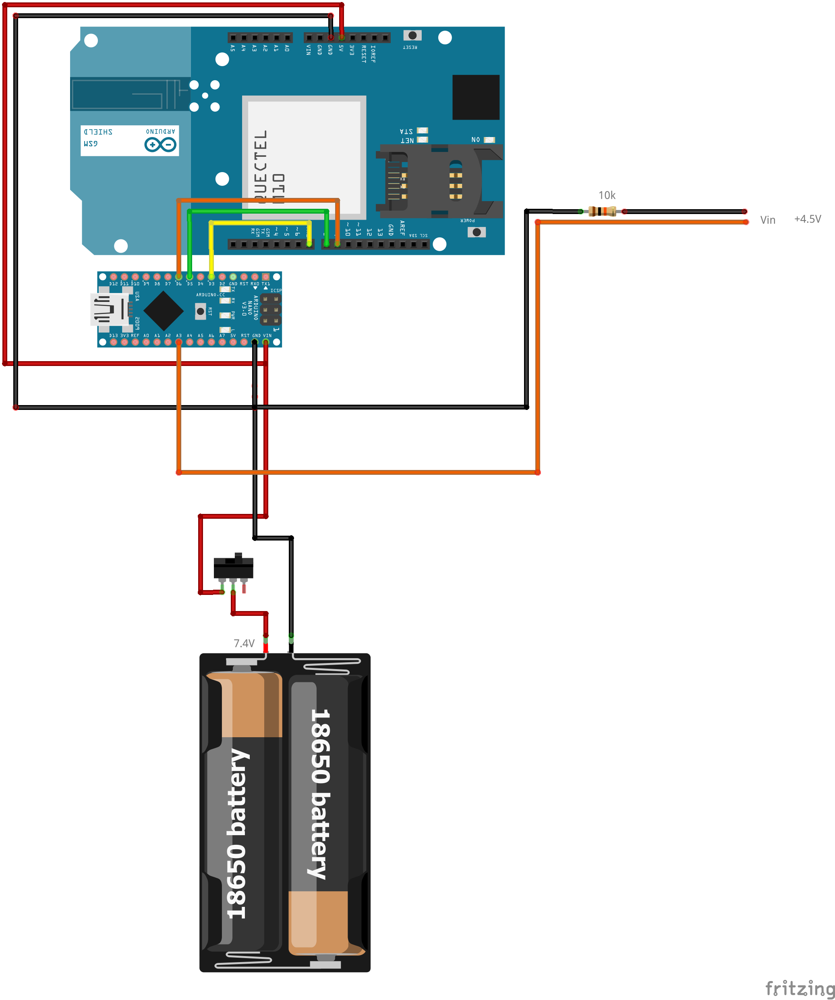

# GSM-SIM-900L
<h1> Arduino GSM </h1>

Senscillo programa desarrollado en C++ que permite realizar llamadas telefónicas por la línea movil gsm cuando el Arudino Nano detecta que una entrada que está continuamente leyendo pasa a estado alto.
 
El objetivo es aprovechar un sistema de alarma ya montado, esta sistema de alarma hace uso de linea de telefono fijo. Con este programa podemos eliminar el coste mensual de la linea de telefono fijo y realizar las llamadas de aviso a través de una línea móvil con un coste de 0€ / mes.

<h4> Componentes </h4>
Arduino Nano V3.0
SiM 900 L
Buck converter
Batrías de litio 18650
BMS
Interruptor

  

El esquema está pendiende de correción
